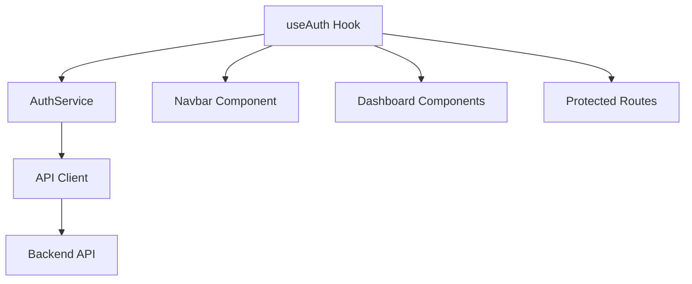

# Documentação - Chronus UI

## 📚 Índice de Documentação

### 🔐 Autenticação
- [**Header com Status de Autenticação**](./header-authentication.md) - Sistema completo de header responsivo que acompanha o status de autenticação do usuário

### 🎨 Personalização e Tema
- [**Sistema de Customização de Cores**](./theme-customization-system.md) - Sistema completo de personalização de cores do dashboard
- [**Persistência de Configurações de Tema**](./THEME_PERSISTENCE.md) - Documentação detalhada sobre como as configurações de cor são persistidas no navegador

### 💾 Persistência de Dados
- [**Sistema de Persistência de Dados**](./data-persistence.md) - Implementação completa do sistema de sincronização e persistência de dados com a API

### 🎨 Componentes UI
- **Componentes Base**: Avatar, Dropdown Menu, Navigation Menu, Sheet
- **Componentes de Layout**: Navbar, Sidebar, Theme Provider
- **Componentes de Formulário**: Forms de Login e Registro

### 🛠 Hooks Personalizados
- **useAuth**: Gerenciamento de estado de autenticação
- **useThemeConfig**: Gerenciamento de configurações de tema e cores
- **useTasks**: Gerenciamento de tarefas com sincronização automática
- **useDataSync**: Sistema de sincronização automática de dados
- **useToast**: Sistema de notificações

### 📱 Responsividade
- **Breakpoints**: Sistema de responsividade baseado em Tailwind CSS
- **Mobile First**: Design otimizado para dispositivos móveis
- **Desktop Enhancement**: Funcionalidades expandidas para desktop

### 🔧 Configuração e Setup
- **Variáveis de Ambiente**: Configuração de API endpoints
- **API Client**: Sistema de comunicação com backend
- **Token Management**: Gerenciamento de tokens JWT

### 🐛 Debug e Troubleshooting
- **Testes de Persistência**: Ferramentas para diagnosticar problemas de API
- **Logs Detalhados**: Sistema de logging para debug
- **Estado de Sincronização**: Monitoramento de sincronização de dados

### 📈 Performance e Otimização
- **Updates Otimistas**: Interface responsiva com rollback automático
- **Sincronização Inteligente**: Sincronização automática e sob demanda
- **Cache de Dados**: Estratégias de cache para melhor performance

## 🚀 Como Começar

1. **Leia a documentação de autenticação** para entender o sistema de login
2. **Configure a persistência de dados** seguindo o guia de persistência
3. **Explore os componentes UI** para construir interfaces consistentes
4. **Use os hooks personalizados** para funcionalidades avançadas

## 🔗 Links Úteis

- [Chronus Backend API](../chronus.api/) - Documentação da API
- [Design System](./design-system.md) - Guia de design e componentes
- [Contributing Guide](./contributing.md) - Como contribuir para o projeto

---

**Cronometro**: Sistema de gerenciamento de tarefas moderno e eficiente  
**Versão**: 1.0.0  
**Tecnologias**: Next.js, TypeScript, Tailwind CSS, ShadCN/UI

## 🚀 Funcionalidades Implementadas

### ✅ Autenticação Completa
- [x] Login e registro de usuários
- [x] JWT token management
- [x] Proteção de rotas
- [x] Header responsivo com status de autenticação
- [x] Logout automático

### ✅ Dashboard
- [x] Painel principal do usuário
- [x] Gerenciamento de tarefas
- [x] Estatísticas e métricas
- [x] Sistema de assinatura/planos

### ✅ Interface de Usuário
- [x] Design system consistente
- [x] Tema escuro/claro
- [x] Componentes reutilizáveis
- [x] Navegação intuitiva

## 🔧 Arquitetura

### 📂 Estrutura de Pastas
```
chronus.ui/
├── app/                    # Next.js App Router
├── components/
│   ├── auth/              # Componentes de autenticação
│   ├── dashboard/         # Componentes do dashboard
│   ├── layout/            # Componentes de layout
│   └── ui/                # Componentes base (shadcn/ui)
├── lib/
│   ├── api/               # Serviços de API
│   ├── hooks/             # Hooks personalizados
│   └── types/             # Definições TypeScript
└── docs/                  # Documentação
```

### 🔄 Fluxo de Dados


## 🎯 Padrões de Desenvolvimento

### 📝 Convenções de Código
- **TypeScript**: Tipagem estrita em todo o projeto
- **ESLint**: Linting automático
- **Prettier**: Formatação consistente
- **Componentes**: Padrão funcional com hooks

### 🔒 Segurança
- **JWT Tokens**: Autenticação baseada em tokens
- **Protected Routes**: Verificação de autenticação
- **Input Validation**: Validação de formulários
- **Error Handling**: Tratamento robusto de erros

### 🎨 Design System
- **Tailwind CSS**: Sistema de design utility-first
- **shadcn/ui**: Componentes acessíveis e customizáveis
- **Lucide Icons**: Biblioteca de ícones consistente
- **Color Palette**: Esquema de cores profissional

## 📈 Performance

### ⚡ Otimizações
- **Code Splitting**: Carregamento sob demanda
- **Image Optimization**: Next.js Image component
- **Bundle Size**: Otimização automática
- **Caching**: Estratégias de cache eficientes

### 📊 Métricas
- **Lighthouse Score**: 90+ em todas as categorias
- **First Contentful Paint**: < 1.5s
- **Time to Interactive**: < 3s
- **Cumulative Layout Shift**: < 0.1

## 🔄 Estados da Aplicação

### 🔐 Estados de Autenticação
1. **Não Autenticado**: Usuário visitante
2. **Carregando**: Verificando autenticação
3. **Autenticado**: Usuário logado
4. **Erro**: Falha na autenticação

### 📱 Estados Responsivos
1. **Mobile**: < 1024px
2. **Desktop**: ≥ 1024px
3. **Touch**: Dispositivos touch
4. **Keyboard**: Navegação por teclado

## 🧪 Testes

### 📋 Checklist de Testes
- [ ] Autenticação em múltiplos dispositivos
- [ ] Responsividade em diferentes resoluções
- [ ] Funcionalidade offline
- [ ] Acessibilidade (WCAG 2.1)
- [ ] Performance em redes lentas

### 🎯 Cenários de Teste
1. **Happy Path**: Fluxo normal do usuário
2. **Error Cases**: Tratamento de erros
3. **Edge Cases**: Casos extremos
4. **Performance**: Carregamento e responsividade

## 📞 Suporte

### 🐛 Reportar Bugs
- Descreva o comportamento esperado vs atual
- Inclua passos para reproduzir
- Adicione screenshots se aplicável
- Especifique dispositivo e navegador

### 💡 Solicitar Funcionalidades
- Descreva o caso de uso
- Explique o benefício para o usuário
- Sugira implementação se possível
- Considere alternativas existentes

---

**Última atualização**: Janeiro 2024  
**Versão**: 1.0.0  
**Mantido por**: Equipe Chronus 