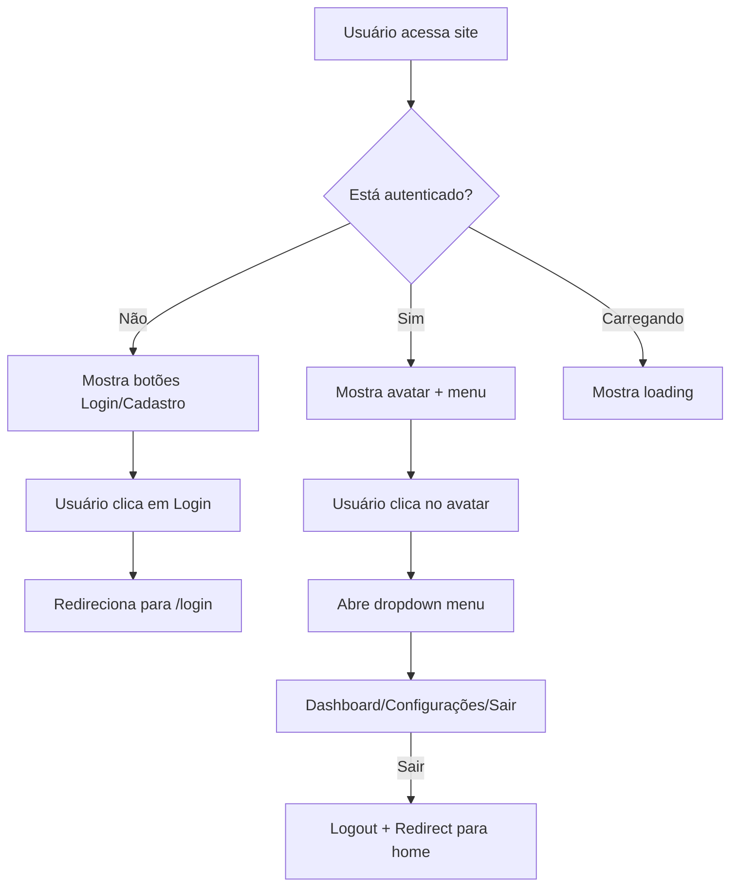

# Header com Status de Autenticação - Chronus

## Visão Geral

O header do Chronus foi desenvolvido para acompanhar dinamicamente o status de autenticação do usuário, oferecendo diferentes interfaces e funcionalidades dependendo se o usuário está logado ou não.

## Funcionalidades Principais

### 🔐 Estados de Autenticação

#### 1. **Usuário Não Autenticado**
- **Desktop**: Botões "Entrar" e "Cadastrar" visíveis no canto direito
- **Mobile**: Menu lateral com opções de login e cadastro
- **Acesso**: Links diretos para `/login` e `/register`

#### 2. **Usuário Autenticado**
- **Desktop**: Avatar com dropdown menu do usuário
- **Mobile**: Card com informações do usuário e menu de opções
- **Informações**: Nome, email e iniciais do usuário

#### 3. **Estado de Carregamento**
- **Indicador**: Ícone de loading (Loader2) animado
- **Exibição**: Durante verificação inicial de autenticação

### 🎨 Componentes Visuais

#### Avatar do Usuário
```tsx
<Avatar className="h-10 w-10">
  <AvatarImage src={""} alt={user?.name || ""} />
  <AvatarFallback className="bg-primary text-primary-foreground">
    {getUserInitials(user?.name)}
  </AvatarFallback>
</Avatar>
```

**Características:**
- Gera iniciais automaticamente a partir do nome completo
- Tratamento robusto de casos edge (nome undefined, null ou vazio)
- Fallback com cor primária do tema
- Tamanho responsivo (10x10 desktop, 8x8 mobile)
- Filtro de palavras vazias e normalização de espaços

**Função getUserInitials:**
```tsx
const getUserInitials = (name: string | undefined | null) => {
  if (!name || typeof name !== 'string' || name.trim() === '') {
    return 'U';
  }
  
  return name
    .trim()
    .split(' ')
    .filter(word => word.length > 0)
    .map(word => word.charAt(0))
    .join('')
    .toUpperCase()
    .slice(0, 2);
};
```

#### Menu Dropdown (Desktop)
**Opções disponíveis:**
- **Dashboard**: Acesso ao painel principal (`/dashboard`)
- **Configurações**: Gerenciamento de conta (`/dashboard/subscription`)
- **Sair**: Logout com redirecionamento para home

#### Menu Mobile
**Para usuário autenticado:**
- Card com avatar e informações do usuário
- Links para Dashboard e Configurações
- Botão de logout com estilo diferenciado (vermelho)

### 🔄 Funcionalidades de Autenticação

#### Logout Automático
```tsx
const handleLogout = async () => {
  try {
    await logout();
    router.push('/');
  } catch (error) {
    console.error('Erro ao fazer logout:', error);
  }
};
```

**Processo:**
1. Chama função `logout()` do hook `useAuth`
2. Limpa tokens e dados do usuário
3. Redireciona para página inicial
4. Trata erros de forma silenciosa

#### Detecção de Mudanças
O componente reage automaticamente a:
- Login/logout em outras abas (localStorage events)
- Mudanças no status de autenticação
- Expiração de tokens

### 🛠 Implementação Técnica

#### Hook de Autenticação
```tsx
const { user, isAuthenticated, isLoading, logout } = useAuth();
```

**Estados monitorados:**
- `user`: Dados do usuário logado
- `isAuthenticated`: Status booleano de autenticação
- `isLoading`: Estado de carregamento inicial
- `logout`: Função para deslogar

#### Gerenciamento de Estado
- **Estado local**: Controle do menu mobile (`isOpen`)
- **Estado global**: Status de autenticação via Context
- **Persistência**: localStorage para tokens JWT

### 📱 Responsividade

#### Desktop (lg+)
- Menu dropdown completo
- Avatar visível
- Navegação horizontal

#### Mobile/Tablet (< lg)
- Menu lateral (Sheet)
- Card de usuário expandido
- Navegação vertical

### 🎯 Segurança

#### Proteção de Rotas
- Links condicionais baseados na autenticação
- Redirecionamento automático após logout
- Verificação de tokens expirados

#### Informações Sensíveis
- Email truncado em telas pequenas
- Tokens não expostos no UI
- Logout limpa dados locais completamente

### 🔧 Configuração e Personalização

#### Cores e Temas
```tsx
// Avatar com cor primária
<AvatarFallback className="bg-primary text-primary-foreground">

// Botão de logout destacado
className="text-red-600 hover:text-red-700 hover:bg-red-50"
```

#### Ícones Utilizados
- `UserCircle`: Dashboard/Perfil
- `Settings`: Configurações
- `LogOut`: Sair
- `Loader2`: Carregamento
- `Menu`: Menu mobile

### 📈 Benefícios da Implementação

1. **UX Consistente**: Interface uniforme em todos os dispositivos
2. **Feedback Visual**: Estados claros para o usuário
3. **Segurança**: Logout adequado e proteção de rotas
4. **Performance**: Carregamento otimizado e estados de loading
5. **Acessibilidade**: Componentes semânticos e navegação por teclado

### 🔄 Fluxo de Uso



### 🧪 Casos de Teste

#### Cenários de Teste
1. **Login/Logout**: Verificar mudanças visuais
2. **Refresh**: Manter estado após recarregamento
3. **Multi-tab**: Sincronização entre abas
4. **Mobile**: Funcionamento em dispositivos móveis
5. **Erro de rede**: Comportamento durante falhas

#### Estados Esperados
- Loading inicial: Máximo 2 segundos
- Avatar: Iniciais corretas do nome
- Menu: Todas as opções funcionais
- Logout: Redirecionamento imediato

### 📚 Dependências

```json
{
  "@radix-ui/react-avatar": "Avatar components",
  "@radix-ui/react-dropdown-menu": "Dropdown functionality",
  "lucide-react": "Icons library",
  "next/navigation": "Navigation hooks",
  "@/lib/hooks/use-auth": "Custom auth hook"
}
```

### 🚀 Próximos Passos

1. **Notificações**: Badge de notificações no menu
2. **Tema**: Toggle de tema no dropdown
3. **Foto**: Upload de foto de perfil
4. **Multi-conta**: Suporte a múltiplas contas
5. **Status**: Indicador de status online/offline

---

## Conclusão

O header implementado oferece uma experiência de usuário completa e profissional, com todos os elementos necessários para um sistema de autenticação moderno. A implementação é responsiva, segura e facilmente extensível para futuras funcionalidades. 